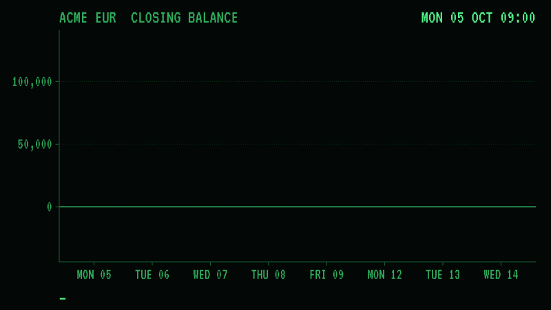
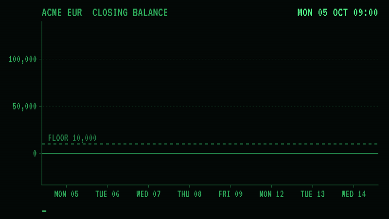

# acme-treasury

[](LICENSE)

**A cash forecast you can check.** It reads what
[mock-sap](https://github.com/rseufert/mock-sap) says is owed and what
[mock-bank](https://github.com/rseufert/mock-bank) says it holds, and says
what the account will close at on each of the next business days. Then the
clocks are moved, the payment run runs, and the bank's statements say whether
it was right.

```
mock-sap   ──open items──────────────▶
                                        acme-treasury  ──▶  closing balance, day by day
mock-bank  ──camt.052, payments,─────▶
             credits, clock, holidays

                        ... a week of mornings and nights ...

mock-bank  ──camt.053──▶  the same figure, or the test fails
```



*mock-sap 0.17.1 and mock-bank 0.7.0, played for a week by mock-acme 0.1.0's payment run: `film/capture.jl`. Every block is a `camt.053`.*

Most cash forecasts are never held to anything: by the time the day arrives
nobody looks back. Both mocks keep a clock a test can move, so here Monday's
forecast for the following Monday is compared, to the cent, with the statement
the bank issues for it.

Written in Julia. Unlike the mocks it takes dependencies:
[HTTP.jl](https://github.com/JuliaWeb/HTTP.jl),
[JSON.jl](https://github.com/JuliaIO/JSON.jl),
[EzXML.jl](https://github.com/JuliaIO/EzXML.jl),
[UnicodePlots.jl](https://github.com/JuliaPlots/UnicodePlots.jl), and
[JuMP](https://jump.dev) with [HiGHS](https://highs.dev) for the payment
schedule.

MIT licensed. By [Rick Seufert](https://rickseufert.com).

---

## Quick start

It needs Julia 1.13 and, to have something to forecast, the two mocks and
[mock-acme](https://github.com/rseufert/mock-acme), whose payment run the demo's setup and the tests use:

```bash
pip install mock-sap mock-bank mock-acme
julia --project=. -e 'using Pkg; Pkg.instantiate()'
bin/demo
```

`bin/demo` starts both mocks on a Monday morning, posts a week's invoices and
a customer's payment, and forecasts it:

```
ACME  EUR  as of 2026-10-05 09:00, before the cutoff
Booked balance now       125,000.00

day                 opening              in             out         closing
Mon 05 Oct       125,000.00            0.00       -1,200.00      123,800.00
Tue 06 Oct       123,800.00        2,000.00            0.00      125,800.00
Wed 07 Oct       125,800.00            0.00      -80,800.00       45,000.00
Thu 08 Oct        45,000.00            0.00            0.00       45,000.00
Fri 09 Oct        45,000.00            0.00            0.00       45,000.00
Mon 12 Oct        45,000.00            0.00      -61,450.00      -16,450.00  <
Tue 13 Oct       -16,450.00       42,500.00            0.00       26,050.00
Wed 14 Oct        26,050.00            0.00            0.00       26,050.00

Lowest: -16,450.00 on Mon 12 Oct
Under the floor of 10,000.00 from Mon 12 Oct

What moves it
  Mon 05 Oct        -1,200.00  payable     INV-A             1000013
  Tue 06 Oct         2,000.00  credit                        Customer Ltd   PAYMENT
  Wed 07 Oct       -80,800.00  payable     INV-B             1000016
  Mon 12 Oct       -61,450.00  payable     INV-E             1000016
  Tue 13 Oct        42,500.00  receivable  0100000011        1000006

Left out
  blocked              -50.00  INV-C             1000013       payment block A
  overdue           29,496.20  0100000001        1000006       due 2025-10-12
  ...
```

An invoice due on Saturday the 10th is paid on Monday the 12th, a day before
the customer's money arrives, and the account is overdrawn for one night.

Against mocks that are already running:

```bash
bin/acme-treasury --sap http://127.0.0.1:8000 --bank http://127.0.0.1:8080
```

| Flag | Default | What it does |
| --- | --- | --- |
| `--sap` | `$SAP_URL`, or `http://127.0.0.1:8000` | mock-sap |
| `--bank` | `$BANK_URL`, or `http://127.0.0.1:8080` | mock-bank |
| `--account` | `ACME` | The account at the bank |
| `--days` | `10` | Business days to look ahead |
| `--customers-late` | `0` | Assume every customer pays this many business days late |
| `--release-blocked` | off | Assume every payment block is lifted |
| `--floor` | `0.00` | Flag a closing balance under this |
| `--plot` | off | Draw the closing balances in the terminal |
| `--json` | off | The forecast, or the plan, as JSON, amounts in minor units |
| `plan` | | As the first argument: the payment schedule instead of the forecast |
| `--apply` | off | With `plan`: set and lift payment blocks in SAP to match. **This writes to SAP**; without it nothing is written |
| `--hold-code` | `T` | The payment block that is the schedule's own |

The exit status is `0`, `1` when a closing balance is under the floor (with
`plan`: when no plan keeps it), and `2` when either side could not be read or
SAP refused a write, so it can stand in a pipeline.

## What it reads

| From | What | How |
| --- | --- | --- |
| mock-bank | The booked balance now | An intraday `camt.052`, asked for on the spot. Opening plus entries must be the interim balance, or it is not believed |
| mock-bank | Payments accepted and not yet settled, and settled payments due to come back | `GET /_mock/payments` |
| mock-bank | Money on its way in | `GET /_mock/credits` |
| mock-bank | Today, the cutoff, the holidays | `GET /_mock/state` |
| mock-sap | Open supplier and customer items, with due dates and blocks | `API_OPLACCTGDOCITEMCUBE_SRV` |
| mock-sap | The invoice number each payable's payment carries | `API_SUPPLIERINVOICE_PROCESS_SRV` |

The `camt.052` and the two OData services are what a real bank and a real
S/4HANA system offer. The three `/_mock` reads are not: a real bank does not
tell you a payment will be returned on Thursday. That is the mock's control
plane, and what comes from it is labelled `payment`, `credit` or `return` in
the output, apart from what SAP said.

Asking for the `camt.052` leaves one message in the bank's mailbox each time.

It writes in one place, and only when told to: `plan --apply` sets and lifts
`PaymentBlockingReason` on `A_SupplierInvoice` with a `PATCH`, behind an
`X-CSRF-Token`. SAP carries the block to the open item.

## What it holds to

Each of these is a way a cash forecast is quietly wrong.

- **A payment at the bank is not owed twice.** SAP keeps an item open until a
  statement clears it, so on the morning after a payment run the same invoice
  is an open item in SAP and a debit at the bank. They are joined on the
  `EndToEndId` and counted once.
- **A blocked item is not money going out.** It is listed with its block, and
  `--release-blocked` says what lifting them all would do.
- **An overdue receivable is not money coming in.** It was due once already.
  mock-sap seeds six of them, 684,875.06 EUR in all, and a forecast that
  believed them would be comfortable and wrong.
- **A payment the bank refused will be refused again.** Its item stays open in
  SAP and every run selects it again; it is listed with the bank's reason.
- **A payment that will come back comes back, and is owed again:** the credit
  on the day of the return, and the payment once more on the next run.
- **A credit the bank already holds replaces the receivable it names**, when
  the payer's reference or note carries the accounting document number. A
  payer who quotes nothing is counted beside the receivable, because nothing
  says they are the same money.
- **After the cutoff, today's run settles tomorrow,** and nothing settles on a
  weekend or a holiday on the bank's list.
- **Another currency is not added up.** mock-bank does no FX and neither does
  this; an item in a currency the account is not in is listed.

It assumes a payment run every business morning, which pays each supplier item
on its due date. That is what `payment_run` in
[mock-acme](https://github.com/rseufert/mock-acme) does.

### The payment schedule

`--floor` says the account will go under. `planpayments` says what to do about
it: which invoices to hold, and until which business day, so that no day
closes under the floor. It is a small mixed-integer program, written in
[JuMP](https://jump.dev) and solved by [HiGHS](https://highs.dev), and like the
forecast it is a pure function of a snapshot.



*mock-sap 0.17.1, mock-bank 0.7.0 and mock-acme 0.1.0, with `plan --apply` before each morning's payment run: `film/capture_plan.jl`. Every block is a `camt.053`.*

On the demo week:

```console
$ bin/acme-treasury plan --days 8 --floor 10000
ACME  EUR  as of 2026-10-05 09:00, before the cutoff
A floor of 10,000.00 over 8 business days

Hold
  INV-E             1000016              61,450.00  due Sat 10 Oct, from Mon 12 Oct to Tue 13 Oct, 1 day

Lowest: 26,050.00 on Tue 13 Oct, where it was -16,450.00 on Mon 12 Oct

In SAP (nothing was changed: --apply does it)
  INV-E             1000016              61,450.00  to block until Tue 13 Oct
```

- **Nothing is held when nothing is wrong.** A forecast that keeps the floor
  gives an empty plan, and the solver is not called.
- **It only moves what a run would pay, and only later,** to a business day
  inside the horizon. Blocked and refused items, other currencies and payments
  already at the bank are not its to move.
- **The least lateness.** Of the plans that keep the floor, the one with the
  smallest sum of amount times business days held, so a large invoice is not
  held where a small one would do, and nothing is held longer than it must be.
- **A floor no plan can keep is not an error.** Holding everything to the last
  day gives every earlier day the best closing any plan can, so a day still
  under the floor then is held to that closing instead, and `shortfall(plan)`
  names the worst of them. The answer on that day is money, not timing.
- **The same snapshot gives the same plan.** Among plans of equal lateness the
  invoice due latest is held longest, then the next; invoices due the same day
  go by reference.
- **The solver chooses the days and nothing else.** The plan's forecast is
  made again by the forecast's own arithmetic, in whole minor units, and
  checked against the floor before it is returned.

A plan is a list, and nothing pays later because a list says so: the payment
run pays every open item that is due and not blocked. `plan --apply` makes the
plan happen the way a user would, with a payment block on each held invoice,
lifted on the morning the plan pays it. The plan is stored nowhere but SAP.
Each business morning, in this order:

1. Post the bank's statements, so SAP knows what was paid yesterday.
2. `acme-treasury plan --apply --floor ...`: plan again from this morning's
   snapshot, block what should wait, release what should go.
3. The payment run.

- **`plan` without `--apply` never writes.**
- **It lifts only its own blocks.** Its holds carry one blocking reason,
  `--hold-code`, `T` unless told otherwise. An invoice somebody blocked with
  any other reason was blocked for a reason: it is never released, and never
  held either.
- **Applying twice changes nothing the second time.** The output says what was
  changed and what was already so.
- **A write SAP refuses is named, and the rest still happen.** The exit status
  is then 2, and the next morning's apply tries it again.
- **The forecast knows the schedule's block from anyone else's.** A blocked
  item is listed under "Left out"; an item the schedule is holding is an
  outflow on the day the schedule would let it go, planned again from the
  same snapshot. Give the forecast the `--floor` the plan is applied with.

mock-sap takes `T` as a blocking reason without being told of it. A real
system has a configured list, and the schedule's code would have to be on it.

## What it cannot know

A forecast taken on Monday morning expects to pay an invoice whose supplier
closed their account last week. The bank refuses it with `AC04`, the money
stays, and Monday's forecast was out by that invoice. Tuesday's lists it under
the bank's reason. `test/mocks.jl` holds both halves, because a forecast that
is checked has to say where it will be wrong.

The same goes for a customer who pays late, short or not at all, and for a
return the bank has not been told to make yet. `--customers-late` is an
assumption, not a prediction: both mocks are deterministic on purpose, so
there is no history here to fit a probability to.

## Tests

```bash
julia --project=. -e 'using Pkg; Pkg.test()'
```

`test/units.jl` holds each rule above against a snapshot written by hand; the
forecast is a pure function of one, so these need nothing running.

`test/mocks.jl` starts both mocks on a pinned clock and plays time forward.
The run each morning is mock-acme's `payment_run`, unchanged, so the forecast
is held to the reference integration and not to a chain written to agree with
it. A schedule is held to the same thing: not that the solver says the
floor holds, but that the bank's statements say it held.

| Test | What it proves |
| --- | --- |
| A week, forecast on Monday and every morning after | Eight forecasts, one each morning, and every closing balance in each of them is the closing balance of the `camt.053` for that day: a payable due on a Saturday, a blocked one, a credit that names nothing and a customer who pays on the due date and quotes the document |
| A return is forecast once the bank knows of it | Under `return-later`, Tuesday's forecast has the money back on Thursday and gone again on Friday, and the statements agree |
| What Monday cannot know | The closed account above: Monday is out by the invoice, Tuesday is not |
| A side that is down is named | SAP or the bank not answering is said in words, with exit status 2 |
| A plan applied in SAP | A dry run leaves SAP as it was; `--apply` blocks the held invoice and the second apply changes nothing; another reason's block is never touched; the block is lifted on its day and the run then pays it |
| A write SAP refuses is named | One `PATCH` answered 423 is reported with what SAP said, the other is still written, and the exit status is 2 |
| The demo week without the schedule | The statement for Monday the 12th closes at -16,450.00: the problem the schedule is for is real |
| The demo week with the schedule | Played with `plan --apply` before each run and a floor of 10,000.00, no statement closes under 26,050.00; INV-E is paid on Tuesday the 13th and every other invoice on its day; what is held only ever shrinks from one morning's plan to the next; and every morning's forecast, knowing its own holds, is the statements' |
| A floor the week's money cannot keep | With a floor of 50,000.00, Monday's plan names 26,050.00 on Wednesday the 14th as the one day under it, and that day's statement is that figure; every other day keeps the floor |
| What Monday's plan cannot know | The closed account, with a floor: Monday holds a small invoice to make room for a large one the bank then refuses, so the hold was for nothing. Tuesday's plan is made from what happened, and its forecast is the statement |

They need a Python with both mocks and mock-acme installed, as in the quick
start: `MOCK_PYTHON`, or `python3`.
Without one they are skipped with a warning and the unit tests still run.

## The film

The film at the top is a real run. `film/capture.jl` starts both mocks, takes
the forecast every morning before the payment run and reads the statement
every night, and writes the two to `film/week.json`. `film/render.jl` draws
from that file alone, with [Makie](https://makie.org), in the look of the
films of the mocks themselves: a phosphor terminal, and red for a problem and
nothing else.

```bash
julia --project=. film/capture.jl                               # needs the mocks, as the tests do
julia --project=film -e 'using Pkg; Pkg.instantiate()'          # once: Makie is large
julia --project=film film/render.jl                             # docs/films/treasury_week.gif and .mp4
```

The film under [The payment schedule](#the-payment-schedule) is made the same
way, from a run of its own: the demo week with a floor of 10,000.00, and
`plan --apply` before each morning's payment run. The renderer calls no
solver; the plan it draws is the one the capture recorded.

```bash
julia --project=. film/capture_plan.jl                          # film/plan.json
julia --project=film film/render_plan.jl                        # docs/films/treasury_plan.gif and .mp4
```

Makie is in its own environment under `film/`, so the forecast does not take
it as a dependency. The renderer needs the VT323 font:
`brew install --cask font-vt323`.

What the film shows is decided by the capture, not the renderer. One
supplier's account is closed at the bank and SAP does not know, so Monday's
forecast expects to pay 9,300.00 that the bank refuses. A statement that
closes where the forecast said is a green block on the line; one that does
not is red, with the distance drawn, and the next morning's forecast replaces
the line. In the second, the stretch of the forecast under the floor is red
until the plan replaces it. The held invoice is never red: holding it is the
fix.

### Publishing a film

The films are indexed the way [mock-films](https://github.com/rseufert/mock-films)
indexes its own, so that whatever reads its `docs/films/index.json`, as
rickseufert.com does, reads this one: one entry for each film, with its name
(stable for the life of the film), the GIF's hash and size, the date its bytes
last changed, the mocks and versions it was captured from, the capture's own
`source`, and its `alt` and `caption`. One field is this repository's own:
`driven_by` is whatever else the capture ran, and at which version, read from
the capture as `mock_versions` is. Here that is mock-acme, whose payment run
made the payments; `mocks` stays the mocks a film shows.

| File | What it is |
| --- | --- |
| `docs/films/words.json` | Written by hand and reviewed like code: each film's `alt`, `caption`, `mocks`, the capture and the renderer it is made from, and an optional `poster_ms` |
| `docs/films/index.json` | The manifest. Written by `film/record.jl`, so its numbers are never typed |
| `docs/films/<name>.sha256` | What the GIF was rendered from: its capture, its renderer and `film/look.jl`, in the format `shasum -a 256 -c` reads |

```bash
julia --project=. film/record.jl        # after rendering
```

The tests fail when a capture, a renderer or `look.jl` has changed since its
film was recorded, or when the manifest is not what recording now would
write, so this page cannot show a film the code no longer makes. A film marked
`finished` is public the next time a site reads the manifest; one that is
pulled is marked `withdrawn` by hand and never dropped. The `alt` and
`caption` claim nothing the capture does not show, and say what the capture
script did itself.

## Layout

| File | What is in it |
| --- | --- |
| `src/forecast.jl` | The forecast: a pure function of a snapshot and a scenario |
| `src/schedule.jl` | The payment schedule: what to hold so the forecast keeps the floor |
| `src/apply.jl` | What SAP has to be told for a plan to happen, and telling it |
| `src/snapshot.jl` | What a snapshot is: open items, payments, credits, the balance, the day |
| `src/wire.jl` | Reading both mocks over HTTP |
| `src/calendar.jl`, `src/money.jl` | Business days, and amounts as whole minor units |
| `src/report.jl`, `src/cli.jl` | The table, the plot, the JSON and the command line |
| `test/world.py`, `test/harness.jl` | The suppliers, the customers and the morning's payment run; starting both mocks |
| `film/` | The captures of the two weeks, and the films drawn from them; `look.jl` is what the two share, and `films.jl` and `record.jl` keep the manifest |
| `docs/films/` | The films, what each was rendered from, and the manifest of them |

## Out of scope

| Left out | Why |
| --- | --- |
| Probabilities | Nothing in two deterministic mocks to fit them to. Scenarios are stated assumptions |
| FX and more than one account | One account, one currency, as mock-bank's accounts are |
| Direct debits and NACHA | The payment run this follows pays by `pain.001` credit transfer |
| Early-payment discounts, late-payment penalties, supplier priority | The schedule costs lateness by amount and days alone; it reads no terms that price a late day and no mark on a supplier who should not be kept waiting |
| Clearing customer items in SAP | Nothing in the chain does it yet, so a paid receivable stays open there and is recognised by the credit that names it |

## See also

[mock-sap](https://github.com/rseufert/mock-sap),
[mock-edi](https://github.com/rseufert/mock-edi) and
[mock-bank](https://github.com/rseufert/mock-bank),
[mock-acme](https://github.com/rseufert/mock-acme), the integration between
them, and [rickseufert.com](https://rickseufert.com/#projects) for the worked examples
that use them together.
